<table align="center" border="0" cellpadding="0" cellspacing="0">
  <tr>
    <td valign="middle" width="200" align="center">
      
    </td>
    <td valign="middle" width="540">
      <h1>You Read, I Read</h1>
      
A persistent reading agent for <a href="https://claude.com/claude-code">Claude Code</a>. 
      You talk; it captures, tracks, learns your taste, and reads with you.

      <pre><code>/plugin marketplace add ZhangZhuoSJTU/YouReadIRead
/plugin install you-read-i-read</code></pre>
    </td>
  </tr>
</table>

  
  &nbsp;
  
  &nbsp;
  
  &nbsp;
  

  

<i>Install once, talk to it forever.</i>

## Highlights

<table>
  <tr>
    <td width="33%" valign="top"><b>1. Capture from any URL</b> arXiv, blog post, PDF, Semantic Scholar, DOI: paste a link and the agent fetches, writes a 7-section structured summary, and files it in your to-read list.</td>
    <td width="33%" valign="top"><b>2. Track groups and topics</b> Watch a research group's publications or a topic across arXiv, Semantic Scholar, and Hacker News (plus optional Twitter / LinkedIn via Apify).</td>
    <td width="33%" valign="top"><b>3. Discover + triage</b> Periodic sweeps surface new candidates. You decide per-card: add, skip, read now, or archive. Every decision is a signal.</td>
  </tr>
  <tr>
    <td valign="top"><b>4. Ranking that learns your taste</b> Accept, reject, finish, and archive shape an in-context preference model. The queue self-curates gradually, without any manual labeling.</td>
    <td valign="top"><b>5. Read together</b> Interactive reading sessions walk you through the structured summary, then drill into the raw paper text on demand with section / page references.</td>
    <td valign="top"><b>6. Your state, your repo</b> Papers, summaries, and signals live in a separate private git repo you control. The plugin tree holds none of it.</td>
  </tr>
</table>

## What you can ask it

<table>
  <thead>
    <tr>
      <th align="left" width="32%">You say</th>
      <th align="left" width="44%">It does</th>
      <th align="left" width="24%">Slash</th>
    </tr>
  </thead>
  <tbody>
    <tr>
      <td><i>"add this paper &lt;url&gt;"</i></td>
      <td>Fetches, writes a 7-section structured summary, files it in your to-read list.</td>
      <td><code>/add &lt;url&gt;</code></td>
    </tr>
    <tr>
      <td><i>"track Stanford NLP"</i></td>
      <td>Watches a group's publications over time.</td>
      <td><code>/track-group &lt;name&gt;</code></td>
    </tr>
    <tr>
      <td><i>"follow papers on LLM agents"</i></td>
      <td>Watches a topic across arXiv, Semantic Scholar, and HN (plus optional Twitter / LinkedIn).</td>
      <td><code>/track-topic &lt;topic&gt;</code></td>
    </tr>
    <tr>
      <td><i>"any new papers since last week?"</i></td>
      <td>Sweeps every tracked source, ranks, and triages with you per-card.</td>
      <td><code>/update</code></td>
    </tr>
    <tr>
      <td><i>"let's read something"</i></td>
      <td>Recommends from the top of your queue and starts an interactive session.</td>
      <td><code>/read</code></td>
    </tr>
    <tr>
      <td><i>"I want to read about tool use"</i></td>
      <td>Searches your queue by keyword, lets you pick a match.</td>
      <td><code>/read tool use</code></td>
    </tr>
    <tr>
      <td><i>"what's on my to-read list?"</i></td>
      <td>Shows the queue, ranked.</td>
      <td><code>/todo</code></td>
    </tr>
    <tr>
      <td><i>"show me everything I read this month"</i></td>
      <td>Browses any subset of your library.</td>
      <td><code>/list --status read --since …</code></td>
    </tr>
    <tr>
      <td><i>"I finished reading X"</i></td>
      <td>Marks read, logs the signal.</td>
      <td><code>/done</code></td>
    </tr>
    <tr>
      <td><i>"skip this one"</i></td>
      <td>Archives without reading.</td>
      <td><code>/archive</code></td>
    </tr>
    <tr>
      <td><i>"push my data"</i></td>
      <td>Commits and pushes your private data repo.</td>
      <td><code>/sync</code></td>
    </tr>
  </tbody>
</table>

The agent learns from every accept, reject, and read, so the queue gradually self-curates. You stay in control: it never auto-adds in default mode, and it never marks a paper read without your explicit yes.

## First run

In any Claude Code session, say `/sync init` (or "set up You Read, I Read"). The agent will:

1. Copy `defaults/config.yaml` to `~/.you-read-i-read/config.yaml`.
2. Ask for a **data-repo remote URL**. This is a separate private git repo for your personal state (papers, summaries, preferences). The plugin tree never holds any of it.
3. Optionally `gh repo create --private` if the remote doesn't exist yet.
4. Scaffold the data dir (with its own `.gitignore` so auth caches stay local).

It will **not** ask for an Apify token here. That's deferred until you opt into Twitter or LinkedIn.

## Optional: Twitter / LinkedIn discovery (Apify)

Off by default. Twitter and LinkedIn discovery route through the [Apify](https://apify.com) MCP server.

**To enable:**

- Say "enable twitter" or "enable linkedin" in your Claude Code session.
- Provide your Apify API token when asked. The first-run flow does not ask for it.
- Both sources stay disabled until you opt in explicitly.

**Cost (Apify ships a $5 / month free tier):**

- **Twitter** (`apidojo/tweet-scraper`):
  - $0.40 per 1 000 tweets.
  - Roughly $0.60 / month at default sweep rates.
  - Fits the free tier comfortably.
- **LinkedIn** (`curious_coder/linkedin-post-search`):
  - $5 per 1 000 posts.
  - Roughly $7.50 / month at default sweep rates.
  - Overshoots the free tier. Mitigations: tighten `tracking_sources.linkedin.max_per_sweep`, sweep less often, or skip LinkedIn entirely.

**Spend cap:**

- Default `max_apify_usd_per_month: 5` per source (in `~/.you-read-i-read/config.yaml`).
- The plugin tracks running monthly spend in `tracking/apify-spend.yaml`.
- Calls are skipped when the cap is approached, with a one-line notice.

**Without Apify, the plugin still works:**

- Twitter falls back to public Nitter mirrors (free, very flaky).
- LinkedIn skips silently with a plain notice.
- arXiv, Semantic Scholar, and Hacker News cover the bulk of CS / ML signal regardless and require nothing.

## How it's built

<table>
  <tr>
    <td><b>Skills</b></td>
    <td>
      <code>paper-curate</code> (ingest + sweep) ·
      <code>paper-read</code> (interactive session, end-of-session prompt) ·
      <code>paper-data</code> (list / edit / sync / first-run)
    </td>
  </tr>
  <tr>
    <td><b>Subagent</b></td>
    <td><code>paper-summarizer</code> for parallel summarization fanout</td>
  </tr>
  <tr>
    <td><b>Helpers</b></td>
    <td>
      <code>scripts/_common.py</code> (config + paper IDs + atomic file ops) ·
      <code>scripts/manage_data.py</code> (single writer, 13 subcommands, 20 unit tests)
    </td>
  </tr>
  <tr>
    <td><b>MCP</b></td>
    <td><code>scripts/apify-mcp-launch.sh</code> spawns the Apify MCP server when <code>APIFY_TOKEN</code> is set; no-op otherwise</td>
  </tr>
  <tr>
    <td><b>State</b></td>
    <td>Personal data lives in a separate private git repo at <code>~/.you-read-i-read/data/</code>. Plugin tree contains zero personal data.</td>
  </tr>
</table>

For the data layout, see [`docs/data-schema.md`](docs/data-schema.md). For the agent's operating invariants, see [`CLAUDE.md`](CLAUDE.md).

## License

[MIT](LICENSE).
